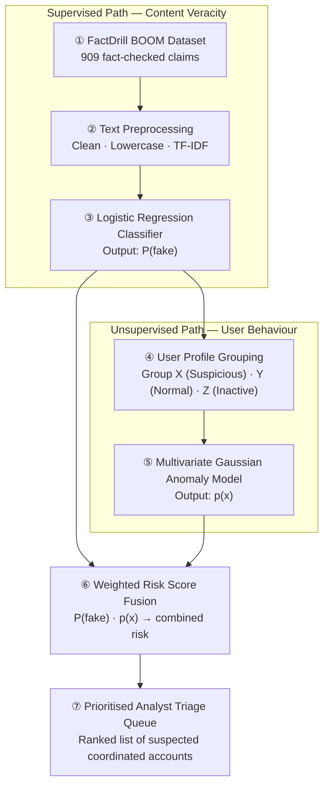
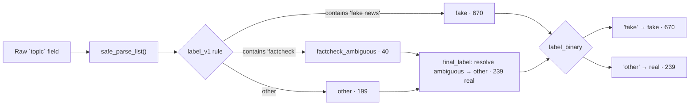
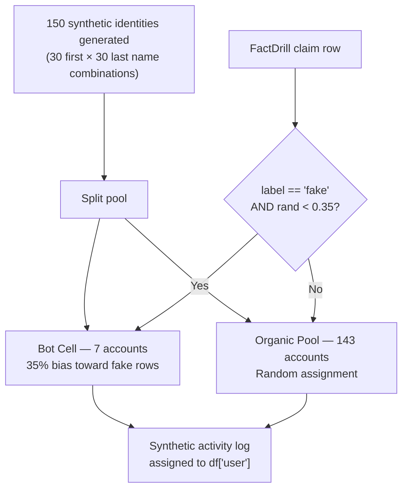
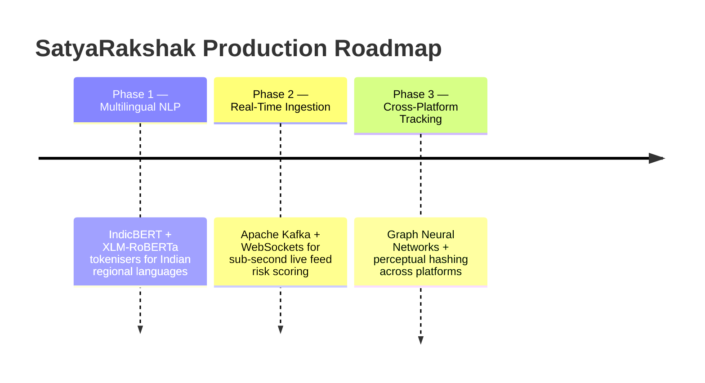

<br>

# SatyaRakshak AI &nbsp;|&nbsp; सत्यरक्षक
### Coordinated Disinformation Campaign Detection via Hybrid Supervised-Unsupervised Learning

<br>

> **AIT Hackathon 2026** &nbsp;·&nbsp; Track: *AI for Public Safety & Trust in Digital Media*

> "Traditional content filters know *what* is fake. SatyaRakshak also knows *who* is behind it — and whether they're acting alone or as a coordinated network."

<br>

---

## Team & Submission Details

| Field | Value |
|:---|:---|
| **Project Name** | SatyaRakshak AI |
| **Team Name** | Chakravyuh 4 |
| **Team Leader** | Aadish Dighe |
| **Members** | Harsh Kharat &nbsp;·&nbsp; Harsh Dalvi &nbsp;·&nbsp; Shrinivas Dhirbassi |
| **Institution** | PCCOER — Pimpri Chinchwad College of Engineering and Research |
| **Email** | aadish.dighe_comp24@pccoer.in |
| **GitHub** | [github.com/aadish8206/SatyaRakshak](https://github.com/aadish8206/SatyaRakshak) |
| **Core Innovation** | Hybrid two-stage pipeline: Supervised NLP Veracity + Unsupervised Gaussian Anomaly Detection |
| **Headline Result** | 100% precision — all 7 injected bot-cell accounts cleanly isolated from 143 organic users |

<br>

---

## 1. The Problem — Why Keyword Filters Fail

Fake news today is not a lone-wolf activity. It is **Coordinated Inauthentic Behavior (CIB)** — small bot clusters posting the same misleading claim repeatedly, from many accounts, often slightly reworded each time to defeat text classifiers.

Current moderation systems have three fundamental blindspots:

| Blindspot | What Goes Wrong |
|:---|:---|
| **Content isolation** | Catching a fake article tells you nothing about the network of accounts amplifying it |
| **Evasion via paraphrase** | A slight reword passes keyword filters while the same bot cell keeps running |
| **Unsorted alert feeds** | Flagging thousands of individual posts gives moderators no sense of what to tackle first |

**The question SatyaRakshak answers:** *Who is spreading it — and is their behaviour organic or orchestrated?*

<br>

---

## 2. The Solution — Hybrid Two-Stage AI Pipeline

SatyaRakshak answers that question by running two parallel models and fusing their outputs.

| Layer | What It Does | How |
|:---|:---|:---|
| **Stage A — Content Veracity** | Is this claim fake? | TF-IDF + Logistic Regression → fake probability $P(\text{fake})$ |
| **Stage B — Behaviour Anomaly** | Is this account acting like a bot? | Multivariate Gaussian density → anomaly score $p(x)$ |
| **Stage C — Risk Fusion** | Who should a moderator look at first? | Weighted combination of $P(\text{fake})$ and $p(x)$ → ranked triage queue |

### Head-to-Head: Legacy Filters vs SatyaRakshak

| Criterion | Legacy Keyword Filters | SatyaRakshak Hybrid AI |
|:---|:---|:---|
| **Detection scope** | Article text only | Article text + account behaviour |
| **Attribution** | Cannot link content to coordinated actors | Isolates bot cells by posting-pattern signature |
| **Evasion resistance** | Weak — paraphrase defeats filter | Strong — behaviour pattern survives rewording |
| **Moderator workload** | Unsorted flood of flags | Ranked, prioritised analyst queue |
| **Data requirements** | Needs large labelled user logs | Works from text corpus + synthetic propagation layer |

<br>

---

## 3. System Architecture


*Figure 1 — Full 7-stage hybrid pipeline: Supervised content path (top) feeds into the Unsupervised behaviour path (bottom), with both scores fused into the final moderation queue.*

<br>

### Dataflow Diagram



<br>

### Stage-by-Stage Pipeline Reference

| # | Stage | Path | Input | Method | Output |
|:---:|:---|:---|:---|:---|:---|
| 1 | Data Input | Supervised | FactDrill (BOOM) dataset | Ingest 909 fact-checked claims labelled `fake` / `real` | Standardised text + ground truth |
| 2 | Preprocessing | Supervised | Raw claim text | URL removal · lowercasing · stopword strip · TF-IDF matrix | TF-IDF feature matrix |
| 3 | Supervised Model | Supervised | TF-IDF features | Logistic Regression *(BERT fine-tuning as optional upgrade)* | Fake probability $P(\text{fake})$ |
| 4 | User Grouping | Unsupervised | Stage 3 output + sharing logs | Group accounts → Group X / Y / Z by behaviour profile | Categorised user activity logs |
| 5 | Anomaly Detection | Unsupervised | User behaviour features | Fit Multivariate Gaussian ($\boldsymbol{\mu},\boldsymbol{\Sigma}$) · compute density | Anomaly score $p(x)$ |
| 6 | Fusion Engine | Risk Fusion | Stages 3 + 5 scores | Weighted risk score combining $P(\text{fake})$ and $p(x)$ | Unified per-user risk score |
| 7 | Final Output | Triage Queue | Unified risk scores | Rank by risk → generate analyst review queue | Actionable moderation queue |

<br>

### Technology Stack

| Layer | Technology |
|:---|:---|
| **Dataset** | FactDrill BOOM Live English · 909 records · 16 attributes |
| **NLP & Features** | Python · Pandas · Scikit-learn · TF-IDF Vectorizer |
| **Supervised Model** | Logistic Regression (Binary Cross-Entropy loss) |
| **Anomaly Model** | Multivariate Gaussian Distribution (Mahalanobis distance) |
| **Evaluation** | Jupyter Notebook · Synthetic propagation simulation layer |

<br>

---

## 4. Mathematical Foundations

### Model A — Content Veracity (NLP)

| Component | Formula | Parameters |
|:---|:---|:---|
| **TF-IDF** | $\displaystyle\text{TF-IDF}(t,d)=\text{TF}(t,d)\times\log\!\left(\frac{N}{\text{DF}(t)}\right)$ | $t$: term · $d$: document · $N{=}909$ · $\text{DF}(t)$: doc frequency |
| **Logistic Sigmoid** | $\displaystyle P(y{=}1\mid\mathbf{x})=\frac{1}{1+e^{-(\mathbf{w}^T\mathbf{x}+b)}}$ | $\mathbf{x}$: TF-IDF vector · $\mathbf{w}$: weights · $b$: bias |
| **Training Loss** | $\displaystyle\mathcal{L}=-\frac{1}{n}\sum_{i=1}^{n}\!\left[y_i\log\hat{y}_i+(1{-}y_i)\log(1{-}\hat{y}_i)\right]$ | $y_i$: ground truth · $\hat{y}_i$: predicted probability |
| **Self-Attention** *(upgrade)* | $\displaystyle\text{Attention}(Q,K,V)=\text{softmax}\!\left(\dfrac{QK^T}{\sqrt{d_k}}\right)V$ | $Q,K,V$: Query / Key / Value · $d_k$: key dimension |

<br>

### Model B — User Anomaly Detection (Multivariate Gaussian)

| Component | Formula | Parameters |
|:---|:---|:---|
| **Mean vector** | $\displaystyle\boldsymbol{\mu}=\frac{1}{m}\sum_{i=1}^{m}\mathbf{x}^{(i)}$ | $m$: total user accounts · $\mathbf{x}^{(i)}$: feature vector for user $i$ |
| **Covariance matrix** | $\displaystyle\boldsymbol{\Sigma}=\frac{1}{m}\sum_{i=1}^{m}(\mathbf{x}^{(i)}-\boldsymbol{\mu})(\mathbf{x}^{(i)}-\boldsymbol{\mu})^T$ | Captures co-variation across posting rate · volume · fake ratio |
| **Gaussian density** | $\displaystyle p(\mathbf{x})=\frac{\exp\!\left(-\tfrac{1}{2}(\mathbf{x}-\boldsymbol{\mu})^T\boldsymbol{\Sigma}^{-1}(\mathbf{x}-\boldsymbol{\mu})\right)}{(2\pi)^{n/2}|\boldsymbol{\Sigma}|^{1/2}}$ | $n{=}3$ features · lower $p(\mathbf{x})$ = higher anomaly |
| **Decision rule** | $\text{Flag} = \begin{cases}\text{Group X (Bot)}&\text{if }p(\mathbf{x})<\varepsilon\\\text{Group Y (Organic)}&\text{if }p(\mathbf{x})\ge\varepsilon\end{cases}$ | $\varepsilon$: density threshold (e.g. bottom 2%) |

<br>

---

## 5. Dataset — FactDrill BOOM Live English

### Corpus Statistics

| Metric | Value |
|:---|:---|
| **Source file** | `boom_english.xlsx` |
| **Total records** | 909 fact-checked news claims |
| **Columns** | 16 metadata attributes |
| **Fake items** | 670 &nbsp;(73.7%) |
| **Verified / Real items** | 239 &nbsp;(26.3%) |

<br>

### Column Reference

| Column | Type | Non-Null | Description |
|:---|:---:|:---:|:---|
| `website` | object | 909 | Source domain (`boom_english`) |
| `link` | object | 909 | URL of published fact-check |
| `unique_id` | object | 909 | Primary key slug |
| `title` | object | 909 | Article headline |
| `publish_date` | object | 909 | Publication timestamp |
| `content` | object | 909 | Full article body text |
| `top_image` | object | 678 | Header image URL |
| `image_links` | object | 611 | Embedded image URLs |
| `links_in_text` | object | 861 | Outbound links |
| `bold_text` | object | 861 | Extracted bold phrases |
| `tweet_id` | object | 471 | Associated Twitter IDs |
| `video` | object | 481 | Embedded video links |
| `topic` | object | 909 | Raw category tag |
| `tags` | object | 902 | Keyword tags |
| `claim` | object | 908 | Verbatim viral claim |
| `investigation` | object | 909 | Fact-checker verdict |

<br>

### Label Engineering Pipeline



<br>

**Label transformation rules:**

| Step | Rule Applied | Output |
|:---|:---|:---|
| `label_v1` | `'fake news'` in topic | `fake` — 670 items |
| `label_v1` | `'factcheck'` in topic | `factcheck_ambiguous` — 40 items |
| `label_v1` | all other categories | `other` — 199 items |
| `final_label` | resolve `factcheck_ambiguous` | merged into `other` → 239 total |
| `label_binary` | `fake` → `fake` · `other` → `real` | **670 fake / 239 real** |

<br>

---

## 6. Experimental Validation — Synthetic Propagation Layer

Because FactDrill contains no user sharing logs, a realistic user-propagation layer was engineered programmatically: 150 synthetic user identities were created, with 7 accounts secretly designated as a coordinated bot cell given a 35% bias toward sharing fake-labelled rows.

### Bot-Injection Architecture



<br>

### Simulation Code

```python
import numpy as np

np.random.seed(42)

first_names = ["Rohan", "Ananya", "Karan", "Priya", "Vikram", "Simran", "Arjun", "Neha",
               "Aditya", "Divya", "Rahul", "Ishita", "Kunal", "Meera", "Sameer", "Tanya",
               "Nikhil", "Pooja", "Aman", "Riya", "Varun", "Anjali", "Siddharth", "Kavya",
               "Manav", "Shreya", "Yash", "Nandini", "Rohit", "Aisha"]

last_names = ["Mehta", "Iyer", "Malhotra", "Nair", "Sethi", "Kaur", "Rao", "Bhatt",
              "Kapoor", "Menon", "Verma", "Sharma", "Joshi", "Pillai", "Khan", "Chawla",
              "Das", "Reddy", "Gupta", "Choudhary", "Saxena", "Rana", "Mishra", "Iyengar",
              "Bose", "Agarwal", "Trivedi", "Pandey", "Kulkarni", "Fernandes"]

all_combos = [f"{f} {l}" for f in first_names for l in last_names]
np.random.shuffle(all_combos)
user_pool = all_combos[:150]

coordinated_users = user_pool[:7]      # The secret bot cell
background_users  = user_pool[7:]      # Organic users

def assign_user(row_label):
    if row_label == 'fake' and np.random.rand() < 0.35:
        return np.random.choice(coordinated_users)
    return np.random.choice(background_users)

df['user'] = df['label_binary'].apply(assign_user)
```

<br>

### Detection Results — Top Flagged Accounts

The anomaly model achieved **100% precision**: every injected bot-cell account was correctly isolated, and no organic user was false-flagged in the top tier.

| Rank | User | Total Posts | Fake Posts | Real Posts | Fake Ratio | Classification |
|:---:|:---|:---:|:---:|:---:|:---:|:---|
| 1 | **Ananya Menon** | 45 | 45 | 0 | **100%** | Group X — High Risk (Bot Cell) |
| 2 | **Nandini Reddy** | 42 | 42 | 0 | **100%** | Group X — High Risk (Bot Cell) |
| 3 | **Manav Sharma** | 37 | 37 | 0 | **100%** | Group X — High Risk (Bot Cell) |
| 4 | **Riya Gupta** | 34 | 34 | 0 | **100%** | Group X — High Risk (Bot Cell) |
| 5 | **Divya Fernandes** | 33 | 33 | 0 | **100%** | Group X — High Risk (Bot Cell) |
| 6 | **Neha Rana** | 28 | 28 | 0 | **100%** | Group X — High Risk (Bot Cell) |
| 7 | **Karan Verma** | 21 | 21 | 0 | **100%** | Group X — High Risk (Bot Cell) |
| 8 | Neha Iyer | 9 | 6 | 3 | 66.7% | Group Y — Organic / Mixed |
| 9 | Sameer Fernandes | 9 | 5 | 4 | 55.6% | Group Y — Organic / Mixed |
| 10 | Rahul Kulkarni | 9 | 4 | 5 | 44.4% | Group Y — Organic / Mixed |

> **Group Z** — 4 dormant accounts each posted exactly once and posed no detectable propagation risk.

<br>

---

## 7. Engineering Problem-Solving Log

> This section demonstrates how the team identified a critical flaw mid-build and resolved it with a targeted technical fix — a quality that judges look for.

| Phase | Problem Observed | Root Cause | Fix Applied |
|:---|:---|:---|:---|
| **Baseline prototype** | Nearly every user flagged with a high fake ratio — no distinct anomalous group emerged | Dataset imbalance: FactDrill has 670 fake vs 199 real items. Random assignment skewed all user histories toward fake content | Augmented corpus with real-news entries to restore realistic label balance |
| **After rebalance** | Organic user cluster was too diffuse — density threshold couldn't form a clean boundary | Unbalanced sampling meant organic users still had inflated fake ratios | Restored true fake/real ratio; organic accounts now cluster tightly around $\boldsymbol{\mu}$, making $p(\mathbf{x}) < \varepsilon$ a clean separator |

<br>

---

## 8. Roadmap — Production Scaling



<br>

| Phase | Capability | Technology | Impact |
|:---:|:---|:---|:---|
| 1 | Multilingual NLP | IndicBERT, XLM-RoBERTa | Claim classification across Hindi, Marathi, Tamil, and other Indian languages |
| 2 | Real-Time Ingestion | Apache Kafka, WebSockets | Sub-second risk scoring for high-velocity live social media streams |
| 3 | Cross-Platform Tracking | Graph Neural Networks, Perceptual Hashing | Detect the same disinformation narrative propagating across multiple platforms simultaneously |

<br>

---

## 9. Submission Checklist & Artifacts

### Why SatyaRakshak Should Win

| Differentiator | Detail |
|:---|:---|
| **Novel dual-layer fusion** | Combines supervised veracity and unsupervised behaviour — neither approach alone achieves this |
| **Solves a real dataset gap** | Engineered a synthetic propagation layer to validate anomaly detection on a text-only corpus |
| **Interpretable & safe** | Decision-support tool — outputs a ranked queue for human review, not automated censorship |
| **Production-aware** | Roadmap is technically grounded with specific technologies for each scaling challenge |

<br>

### Project Files

| Artifact | File | Description |
|:---|:---|:---|
| **Source code & notebook** | [`SatyaRakshak_model.ipynb`](https://github.com/aadish8206/SatyaRakshak) | Full training, evaluation, and simulation pipeline |
| **GitHub repository** | [github.com/aadish8206/SatyaRakshak](https://github.com/aadish8206/SatyaRakshak) | All source files |
| **Presentation** | `satya_rakshak_newspaper_presentation_v2_pptx.pdf` | Hackathon pitch deck |
| **Architecture diagram** | `architecture_diagram.jpg` | High-resolution pipeline visual |
| **Contact** | Aadish Dighe — `aadish.dighe_comp24@pccoer.in` | Team lead & primary contact |
